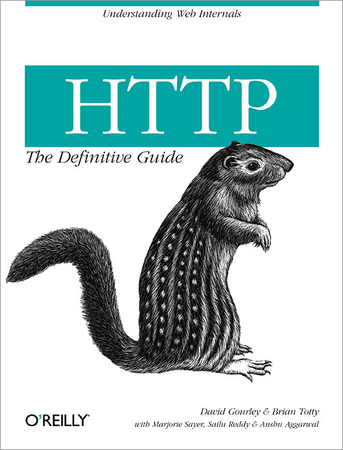

# HTTP 완벽가이드 스터디

  

#### [Insight](http://www.insightbook.co.kr/) 출판사의 `HTTP: THE DEFINITIVE GUIDE`[[PDF]](http://www.staroceans.org/e-book/O'Reilly%20-%20HTTP%20-%20The%20Definitive%20Guide.pdf) 번역본, `HTTP 완벽가이드` 를 스터디하는 모임

## 정보

- 이 repository는 용량이 큰 바이너리 혹은 문서파일들의 저장소로 사용합니다.
- 스터디 진행은 [노션 페이지](https://www.notion.so/changemyuniform/HTTP-39ba25ead15a40b38fd30e3ac2628aa5)에서 진행합니다.

### 진행방법 & 목표
- 마지막 챕터까지 완료 하는 것
    - 구글 프레젠테이션 사용해서 진행
    - 바이너리 익스포트 하거나 링크를 GitHub 에 저장하는 걸로

- 깊게 진행할지 빠르게 훑어 볼지
    - **빠르게 가기로 하자**
    - 다시 한 번 찾아봐야 될 챕터는 모아두고 후순위로 진행하도록 하자

- 분량 조절 어떻게
    - 각자 1챕터씩 진행하고 1회 스터디에 4챕터씩 진행해보자
    - 1챕터 진행 분량은 어느정도?
        - 15 ~ 20분 진행
        - 질/답 시간 가지고 답변을 못하겠으면 다음 발표 시간에 답변하기로...

### 일정 [(스케쥴)](https://www.notion.so/changemyuniform/e9f75f3988f64f2eb3a9627ce28f31dc?v=c65f566a91a74854abf96f74a86c047e)
- 기본은 격주로 진행하고
- 특별한 사정이 있고 모두 동의하면 한 주 땡기거나 미루거나 하자

- 계속 노션 쓸것인가? → 무료 플랜  1000블럭이 한계
    - GitHub 에 올리는 걸로 하자

- 어디서 볼 지
    - 위워크를 무료 이용 가능! by @Doohwan Kim
    - 매번 종로 위워크에서 보지 말고 장소를 돌아가며 진행해보자!

### 발표 목록

**13장, 18장, 19장, 20장, 21장 제외**

**`총 16장 진행`**

1. HTTP 웹의 기초
   1. HTTP 개관:[발표자료](https://docs.google.com/presentation/d/11H9R1Tuoi7ERd0WU3TlGCxqnFaHb1GJf6W5eAxMr_5Y/edit?usp=sharing) @SEONG HUN KONG
   2. URL과 리소스:[발표자료](https://docs.google.com/presentation/d/1VVFdDZQlV3W3v6cYDFUf_-oXqpB1lnQRP7t8hOwxP4M/edit?usp=sharing) @Siyoung Jung
   3. HTTP 메시지:[발표자료](https://docs.google.com/presentation/d/1pbqmXl73twrlGy8iA0NlG5goYxX_sj0SYtUg731BH8c/edit?usp=sharing) @Jeongsik Yun
   4. 커넥션 관리:
   5. 웹 서버:
   6. 프락시: WIP [발표자료](https://docs.google.com/presentation/d/1oQ5-lFPXKYfq-Wj7GvbrEiWfmhwhPdu9YtS9Nj4gvFM/edit?usp=sharing) @Siyoung Jung
   7. 캐시: WIP [발표자료](https://docs.google.com/presentation/d/1XIPtvaG5iHXsm_mNPVvLj_9ymCCa2XSrt5e-nI0G0w8/edit?usp=sharing)
   8. 통합점: 게이트웨이, 터널, 릴레이:
   9. 웹 로봇:
   10. HTTP2
   11. 클라이언트 식별과 쿠키: [발표자료](https://docs.google.com/presentation/d/1w3cPIWiqECKTkdvwYdhwRSWA4FSXS-VCq47zaguYUmE/edit?usp=sharing) @Siyoung Jung
   12. 기본 인증

### 추가적으로 할 일

- GitHub 팀 계정 파기 - @Jeongsik Yun 💿
- GitHub 레포 파기/공유 - @Jeongsik Yun 💾
- 워워크 예약 - @Doohwan Kim 🔖
- 저녁 식사 알아보기 - @SEONG HUN KONG 💁🏼‍♂️🍔
- GitHub 메인테이너 - @Siyoung Jung 🎤
- 발표할 때 문서 정리/질답 정리 -  각자 알아서 한다. ✍️
